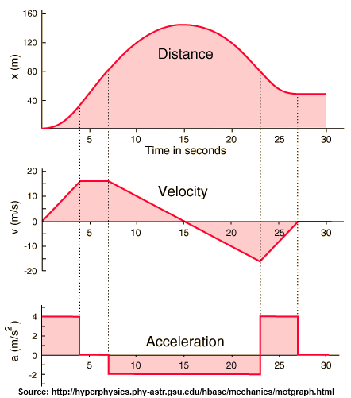

# Derivatives, Calculus and Rate of Change

The central concepts in calculus are derivatives and integrals. A derivative is simply a rate of change. Taking an integral is the inverse of taking a derivative. Graphically, the integral is the area under the curve. One of the easiest examples to further understand this concept is looking at distance, velocity and acceleration.

If we were to take the derivative of the distance graph, we would get the velocity graph shown below it. Similarly, if we take the derivative of the velocity graph, we will get the acceleration graph.
